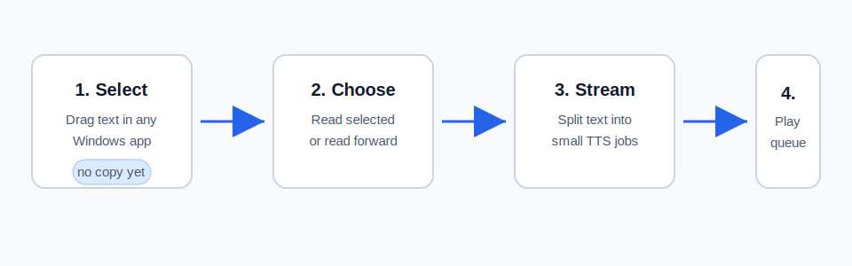
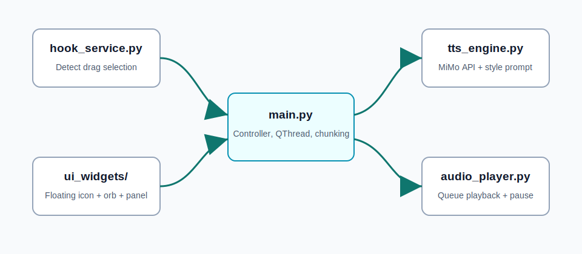
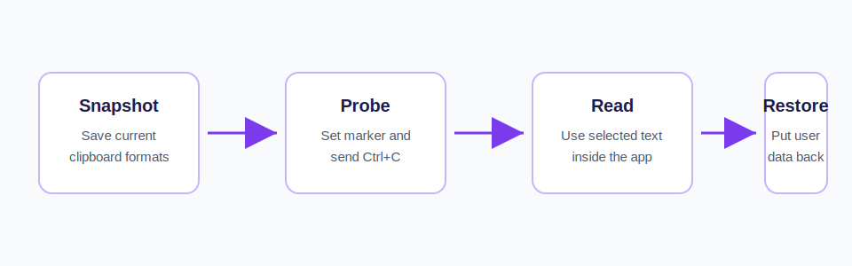

# 从“划词”到“听书”：做一个 Windows 全局 MiMo TTS 朗读助手

> 这篇文章写给刚开始做桌面工具、TTS 应用和 Python GUI 的朋友。我们不只讲代码怎么写，也讲为什么要这样设计。



## 1. 我们想解决什么问题

很多人第一次接触 TTS，会做一个很自然的 demo：一个文本框，一个按钮，点一下生成语音。这个 demo 很适合学习 API，但用起来并不顺手。

真实阅读发生在很多地方：

- 浏览器里的长文章
- Word 或 PDF 里的材料
- 微信、飞书、邮件里的消息
- 技术文档、论文、小说、新闻

如果每次都要复制文字、切到 TTS 程序、粘贴、点击朗读，体验就断掉了。我们真正想要的是：

**我在哪里读，就在哪里听。**

于是这个项目的核心产品形态变成了一个“全局朗读辅助软件”：你在任何软件里划选文字，鼠标旁边弹出一个小按钮，点击就读。

## 2. 这个工具的交互设计

它有三个入口：

1. 划词后的浮动按钮：负责“朗读选中”和“从此往下读”
2. 桌面悬浮球：平时常驻在屏幕边缘
3. 配置面板：设置音色、方言、情绪、语速、暂停、停止

这里有一个小原则：**高频动作要近，低频配置要藏。**

划词后最需要的是“读”，所以按钮直接出现在鼠标旁边。音色、方言这些不是每次都改，所以放在悬浮球背后的配置面板里。停止朗读很紧急，所以右键悬浮球就能触发。

## 3. 代码架构



项目拆成几块：

- `hook_service.py`：监听全局鼠标拖拽
- `ui_widgets/float_icon.py`：显示划词后的浮动按钮
- `ui_widgets/desktop_orb.py`：桌面悬浮球
- `ui_widgets/config_panel.py`：配置面板
- `main.py`：主控逻辑，把所有模块串起来
- `tts_engine.py`：调用 MiMo TTS API
- `audio_player.py`：队列播放音频
- `clipboard_reader.py`：保护剪贴板

这种拆法不是为了显得“高级”，而是为了让每个文件只操心一件事。以后要改 UI，不用碰 API；要换 TTS 服务，也不用碰鼠标钩子。

## 4. 为什么长文不能一次性发给 TTS

大模型 TTS 通常有输入长度、响应时间和稳定性的限制。如果把一整篇几千字文章一次性发给接口，会遇到几个问题：

- 请求太慢，用户等不到第一句话
- 服务端可能限制长度
- 失败后要重来整篇
- 播放器无法边生成边播放

所以我们把长文按标点切成小段：

```python
chunks = re.split(r'([。！？；\n])', text)
```

然后后台一段一段请求。第一段生成完马上进播放器，后面的段落继续在后台生成。这就是“边下边播”的体验。

## 5. 为什么要用 QThread

桌面 GUI 最大的忌讳是：在主线程里做慢操作。

网络请求、文件写入、长文 TTS 都可能很慢。如果它们在主线程里执行，界面就会卡死，按钮按不动，窗口像假死一样。

所以项目里用了 Qt 的 `QThread`：

- 主线程负责 UI
- worker 线程负责请求 TTS
- worker 生成一段音频后，通过 signal 发给播放器

这样用户可以在朗读过程中继续暂停、停止或修改配置。

## 6. 剪贴板保护：一个容易被忽视的细节

全局划词朗读最麻烦的点之一，是“怎么拿到用户选中的文字”。

很多软件没有统一的“读取当前选区”接口。最兼容的方法是模拟 `Ctrl+C`，然后从剪贴板读取文本。但这有一个副作用：用户原本复制的内容会被覆盖。

这很烦。比如你刚复制了一个链接，划词朗读一下，回头 `Ctrl+V` 发现链接没了。

所以项目做了一个安全复制流程：



关键点有两个：

1. 划词时不复制，只显示按钮
2. 点击朗读时，短暂复制选区，然后恢复用户原剪贴板

这让“朗读所需的复制”变成内部实现细节，而不是用户可感知的副作用。

## 7. 暂停和停止有什么区别

停止很简单：清空队列、停止播放器、取消后台任务。

暂停更细：

- 当前正在播放的音频要停在原位置
- 已经生成但还没播放的音频要保留
- 后台 worker 不应该继续无限请求新分片

所以暂停做了两层：

- `audio_player.py` 暂停当前 `QMediaPlayer`
- `main.py` 里的 worker 在每个分片前检查 `is_paused`

如果当前分片请求已经发出，它会等这次请求结束；但之后不会继续请求下一段。

## 8. API key 为什么不要写进代码

早期 demo 很容易把 API key 直接写进源码，跑起来最快。但一旦要发给别人或推到 GitHub，这就是安全风险。

这个项目支持三种配置来源：

1. 环境变量 `MIMO_API_KEY`
2. 本地 `config.json`
3. 默认空配置

推荐使用环境变量：

```powershell
setx MIMO_API_KEY "你的 API key"
```

这样代码仓库、配置模板和打包出来的 exe 都不需要包含密钥。分享给别人时，让对方设置自己的环境变量即可。

## 9. 新人可以怎么继续玩

这个项目很适合继续扩展：

- 加快捷键：比如全局 `Alt+R` 开始朗读
- 加音量滑块
- 加朗读历史
- 加“清理临时音频”按钮
- 换成别的 TTS 服务
- 做一个安装包
- 给悬浮球做拖拽吸边

最好的学习方式不是一次看懂所有代码，而是选一个小功能，从 UI 到主控再到后端串起来改一遍。你会很快理解桌面应用的事件流、线程和状态管理。

## 10. 小结

MiMo TTS Desktop Reader 的核心不是“调用一个 TTS API”，而是把 TTS 变成一个真正贴近日常阅读的桌面体验。

它把几个小技术点串在了一起：

- 全局鼠标监听
- 不抢焦点的浮动 UI
- 安全剪贴板读取
- 文本切片
- 后台线程
- 队列播放
- 暂停/停止状态管理
- 环境变量密钥管理

这些技术单独看都不复杂，但组合起来，就能做出一个真的愿意每天打开的小工具。
